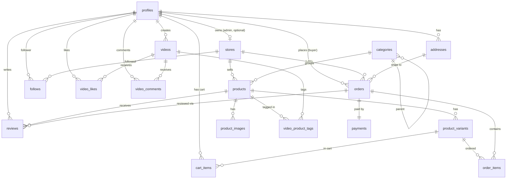

# ERD — WANU (Video Commerce App)

> **Entity Relationship Diagram + Schema**
> Versi: 0.2 (MVP) · Tanggal: 2026-06-08 · DB: Supabase Postgres
> Lihat juga: [PRD.md](./PRD.md), [TRD.md](./TRD.md)

> **⚠️ Perubahan arah (2026-06-08): SINGLE-STORE + role admin.**
> Schema dasar tetap, tapi semantiknya berubah:
> - `stores` jadi **singleton** (1 baris WANU Studio, di-seed; `owner_id`
>   nullable karena tak terikat 1 user). `products.store_id` default ke store itu.
> - Pengelolaan katalog/video diatur role **`admin`** (`profiles.role`) lewat
>   fungsi `is_admin()` — bukan kepemilikan toko. Tabel `stores`, `follows`,
>   `videos.store_id` masih ada tapi efektif menunjuk ke satu toko.
> - Checkout single-store → **1 order per checkout** (tetap di-group per store
>   untuk forward-compat). `payments.provider` = `'mock'` di fase awal.
> - Detail RPC checkout/bayar fase mock: lihat TRD §4.2.

## 1. Diagram (Mermaid)



## 2. Entitas & Kolom

### 2.1 `profiles` (extends `auth.users`)
| Kolom | Tipe | Catatan |
|---|---|---|
| id | uuid PK | = auth.users.id |
| username | text unique | |
| display_name | text | |
| avatar_url | text | Supabase Storage |
| bio | text | |
| role | enum(`buyer`,`seller`,`admin`) | default buyer; **`admin`** = pengelola WANU (`seller` legacy/tak dipakai) |
| created_at | timestamptz | |

### 2.2 `stores` (singleton — toko brand WANU)
| Kolom | Tipe | Catatan |
|---|---|---|
| id | uuid PK | singleton `1111...1111`, di-seed |
| owner_id | uuid FK → profiles | **nullable** (toko tak terikat 1 user) |
| name | text | |
| slug | text unique | |
| logo_url | text | |
| description | text | |
| is_verified | bool | default false |
| created_at | timestamptz | |

### 2.3 `addresses`
| Kolom | Tipe | Catatan |
|---|---|---|
| id | uuid PK | |
| user_id | uuid FK → profiles | |
| recipient_name | text | |
| phone | text | |
| line1 | text | |
| city | text | |
| province | text | |
| postal_code | text | |
| is_default | bool | |

### 2.4 `categories`
| Kolom | Tipe | Catatan |
|---|---|---|
| id | uuid PK | |
| parent_id | uuid FK → categories | nullable (nested) |
| name | text | |
| slug | text unique | |

### 2.5 `products`
| Kolom | Tipe | Catatan |
|---|---|---|
| id | uuid PK | |
| store_id | uuid FK → stores | default = store singleton WANU |
| category_id | uuid FK → categories | |
| title | text | |
| description | text | |
| base_price | int | rupiah (smallest unit) |
| is_active | bool | default true |
| search_tsv | tsvector | generated, FTS |
| created_at | timestamptz | |

### 2.6 `product_variants` (sumber harga & stok sebenarnya)
| Kolom | Tipe | Catatan |
|---|---|---|
| id | uuid PK | |
| product_id | uuid FK → products | |
| name | text | mis. "Merah / XL" |
| sku | text | |
| price | int | rupiah |
| stock | int | ≥ 0 |
> Produk tanpa varian tetap punya 1 variant default.

### 2.7 `product_images`
| Kolom | Tipe |
|---|---|
| id | uuid PK |
| product_id | uuid FK → products |
| url | text |
| sort_order | int |

### 2.8 `videos` (short-form feed)
| Kolom | Tipe | Catatan |
|---|---|---|
| id | uuid PK | |
| creator_id | uuid FK → profiles | seller/kreator |
| store_id | uuid FK → stores | nullable |
| caption | text | |
| cf_playback_id | text | Cloudflare Stream ID |
| cf_thumbnail_url | text | |
| duration_sec | int | ≤ 90 |
| status | enum(`processing`,`ready`,`failed`) | |
| like_count | int | denormalized counter |
| comment_count | int | denormalized counter |
| created_at | timestamptz | |

### 2.9 `video_product_tags` (M:N video ↔ product)
| Kolom | Tipe |
|---|---|
| id | uuid PK |
| video_id | uuid FK → videos |
| product_id | uuid FK → products |
| PRIMARY KEY | (video_id, product_id) |

### 2.10 `video_likes`
| Kolom | Tipe |
|---|---|
| video_id | uuid FK → videos |
| user_id | uuid FK → profiles |
| created_at | timestamptz |
| PK | (video_id, user_id) |

### 2.11 `video_comments`
| Kolom | Tipe |
|---|---|
| id | uuid PK |
| video_id | uuid FK → videos |
| user_id | uuid FK → profiles |
| body | text |
| created_at | timestamptz |

### 2.12 `follows` (user → store)
| Kolom | Tipe |
|---|---|
| follower_id | uuid FK → profiles |
| store_id | uuid FK → stores |
| PK | (follower_id, store_id) |

### 2.13 `cart_items`
| Kolom | Tipe | Catatan |
|---|---|---|
| id | uuid PK | |
| user_id | uuid FK → profiles | |
| variant_id | uuid FK → product_variants | |
| quantity | int | ≥ 1 |
| UNIQUE | (user_id, variant_id) | |
> Cart cukup tabel item (tanpa header). Grouping per-seller dihitung saat checkout.

### 2.14 `orders`
| Kolom | Tipe | Catatan |
|---|---|---|
| id | uuid PK | |
| buyer_id | uuid FK → profiles | |
| store_id | uuid FK → stores | selalu store WANU (single-store → 1 order/checkout) |
| address_id | uuid FK → addresses | snapshot alamat juga disimpan |
| status | enum | lihat di bawah |
| subtotal | int | |
| shipping_fee | int | flat MVP |
| total | int | |
| midtrans_order_id | text unique | |
| created_at | timestamptz | |

**Status enum `orders`:** `pending` → `paid` → `processing` → `shipped` → `completed` · `cancelled` · `expired`

### 2.15 `order_items` (snapshot harga saat beli)
| Kolom | Tipe | Catatan |
|---|---|---|
| id | uuid PK | |
| order_id | uuid FK → orders | |
| variant_id | uuid FK → product_variants | |
| product_title | text | snapshot |
| variant_name | text | snapshot |
| unit_price | int | snapshot (harga saat checkout) |
| quantity | int | |
> Harga di-snapshot supaya perubahan harga produk tidak mengubah order lama.

### 2.16 `payments`
| Kolom | Tipe | Catatan |
|---|---|---|
| id | uuid PK | |
| order_id | uuid FK → orders | unique |
| provider | text | `'mock'` (fase awal) → `'midtrans'` |
| snap_token | text | |
| transaction_id | text | dari Midtrans |
| payment_type | text | va/gopay/card |
| gross_amount | int | |
| status | enum(`pending`,`settlement`,`capture`,`deny`,`expire`,`cancel`) | |
| raw_payload | jsonb | audit webhook |
| paid_at | timestamptz | |

### 2.17 `reviews`
| Kolom | Tipe | Catatan |
|---|---|---|
| id | uuid PK | |
| order_item_id | uuid FK → order_items | unique (1 item = 1 review) |
| product_id | uuid FK → products | |
| user_id | uuid FK → profiles | |
| rating | int | 1–5 |
| comment | text | |
| created_at | timestamptz | |

## 3. Catatan Desain Penting

1. **Stok ada di `product_variants`, bukan `products`** — produk simpel tetap punya 1 variant default.
2. **Single-store → 1 order per checkout:** karena hanya ada 1 toko (WANU), checkout menghasilkan 1 `orders`. Logic checkout tetap meng-group cart per `store` (`create_orders_from_cart`) untuk forward-compat, tapi praktiknya selalu 1 grup. *(Implementasi di TRD §4.2.)*
3. **Snapshot di `order_items`** (title, variant, harga) supaya order historis tidak berubah saat produk diedit/dihapus.
4. **Counter denormalized** (`like_count`, `comment_count`) di `videos` di-update via trigger/Edge Function biar feed cepat.
5. **Decrement stok** hanya saat `payments.status = settlement/capture` (di webhook), lihat TRD §4.2.
6. **RLS wajib semua tabel** — lihat kebijakan contoh di TRD §7.

## 4. Indeks Penting

```sql
CREATE INDEX idx_products_search ON products USING GIN (search_tsv);
CREATE INDEX idx_videos_feed ON videos (status, created_at DESC);
CREATE INDEX idx_order_items_order ON order_items (order_id);
CREATE INDEX idx_cart_user ON cart_items (user_id);
CREATE INDEX idx_variants_product ON product_variants (product_id);
```
